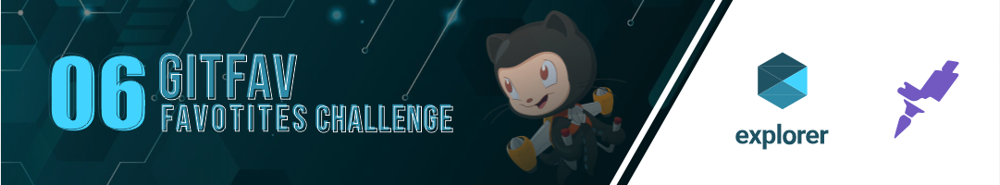
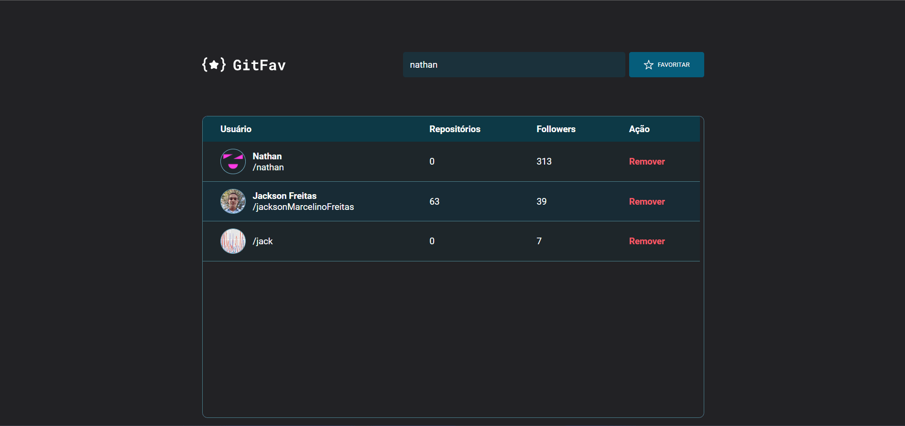
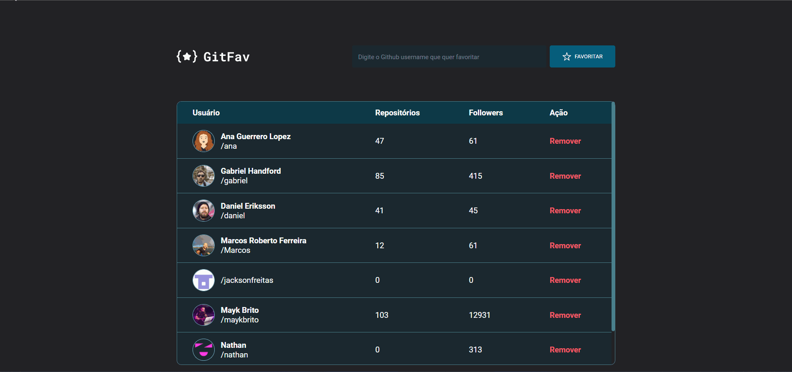

    GitFav
    favorite the profile you like

    

#

### Resources Used
🔸JavaScript 

🔸Html

🔸CSS

🔸API GitHub

    <a href="https://github.com/jacksonMarcelinoFreitas" style="display: inline_block">
        
        
By Jackson Freitas

    </a>

